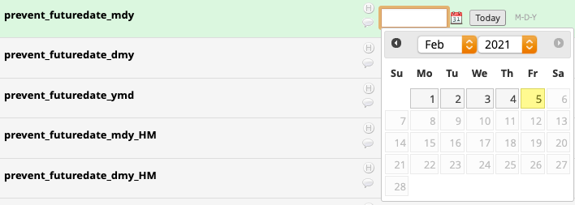

# Prevent Past or Future Dates

This REDCap module adds actions tags __@PREVENT-FUTUREDATE__ and __@PREVENT-PASTDATE__ that can be applied to date fields - i.e., a text field with date validation applied - to disallow entry of dates in the future or past, respectively. The tags are mutually exclusive, applying both tags will not result in any date restrictions. To enforce today's date use the __@TODAY__ action tag instead.

## Prerequisites
- REDCap >= 10.0.1

## Installation
- Clone this repo into to `<redcap-root>/modules/prevent_past_or_future_dates_v0.0.0`.
- Go to **Control Center > Manage External Modules** and enable _Prevent Past or Future Dates_.
- For each project you want to use this module, go to the project home page, click on **Manage External Modules** link, and then enable _Prevent Past or Future Dates_ for that project.

## Expected Behavior

### Scenarios

|                              | Applied Tags                             | Dates available in Datepicker                                                         |
| -------------                | -------------                            | -------------                                                                         |
| Scenario 1                   | @PREVENT-FUTUREDATE                      | past - today                                                                          |
| Scenario 2                   | @PREVENT-PASTDATE                        | today - future                                                                        |
| Scenario 3 __NOT SUPPORTED__ | @PREVENT-FUTUREDATE && @PREVENT-PASTDATE | N/A - supplying both tags will not apply any date restrictions use __@TODAY__ instead |

### Existing Data
The action tags will _only_ apply to empty fields; if data already exists in a field when the form is loaded the action tag will _not_ apply to that field. This is to prevent annoyances when revisiting forms.

### Date vs Datetime field
This module handles date fields and datetime fields slightly differently:
* If a datetime field fails validation and the datetimepicker is opened and loses focus, the input will be updated automatically to the closest valid date.
* If a date field fails validation and the datepicker is opened and loses focus, the input will not be updated automatically. A validation alert will display and the value will need to be updated manually.
